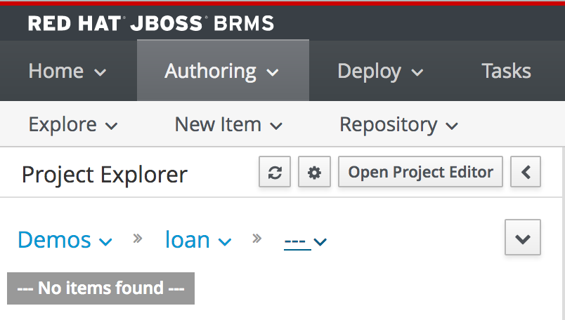

We can now create our first rules project. A JBoss BRMS rules project can contain various types of rule assets:

- DRL: Rule definitions written in the *Drools Rule Language*
- Guided Rules: rules written in a more business friendly language, including a business friendly editors
- Guided Decision Tables: rules written in the form of a decision table.
- etc.

To create the project, perform the following steps:
- First, make sure to select the "loan" repository in the breadcrumbs right under the text *Project Explorer*.

1. Click on *Authoring -> Project Authoring”*
2. Click on *New Item -> Project*
3. Provide the following details:
⋅⋅1. Project Name: `loandemo`{{copy}}
⋅⋅2. Group ID: `com.redhat.demos`{{copy}}
⋅⋅3. Artifact ID: `loandemo`{{copy}}
⋅⋅4. Version: `1.0`{{copy}}
4. Click on the *Finish* button

We've now created our first BRMS project and can now start creating rules assets. We will begin with creating our domain-model.
