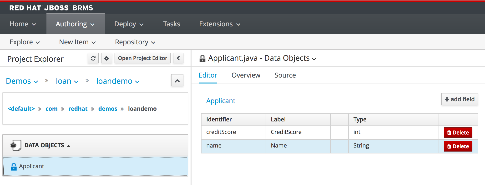
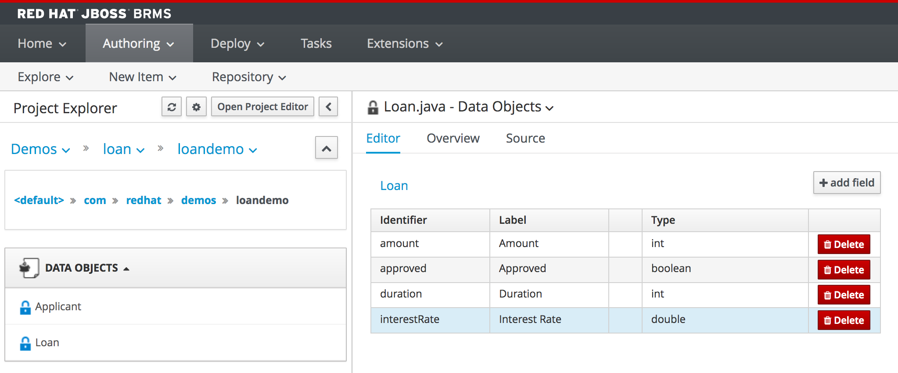

The first asset we need to create is our data-model. The data-model defines the rule *facts* on which we will execute our rules.

A data-model in JBoss BRMS can have many forms. As BRMS is a Java-based rules engine, it operates on Java POJOs (Plain Old Java Objects). As such we can both re-use existing (corporate) data-models defined in external JARs (Java Archives), as well as define these POJOs in our rules project as assets. JBoss BRMS provides a simple data modeling tool that allows business users to create their data-models without having to know the Java programming language.

We will create a simple data model consisting of 2 classes: *Applicant* and *Loan*.

- Click on *New Item -> Data Object*
- Give the object the name `Applicant`{{copy}}
- Set the package to `com.redhat.demos.loandemo`{{copy}}
- Click on *OK*

Give the object two fields:
- Click on *+ add field*
- Add the field with *Id* "creditScore" and *Label* "CreditScore" of type "int".
- Click on *Create and Continue*
- Add the field with *Id* "name" and *Label* "Name" of type "String"
- Click on *Create*
- Click on the *Save* button to save the model.

Next, create a data object with name `Loan`{{copy}} in package `com.redhat.demos.loandemo`{{copy}} with the following fields:

- amount: int (Label: Amount)
- approved: boolean (Label: Approved)
- duration: int (Label: Duration)
- interestRate: double (Label: InterestRate)

Make sure to also save this model using the *Save* button in the editor. We can now create our rules.

