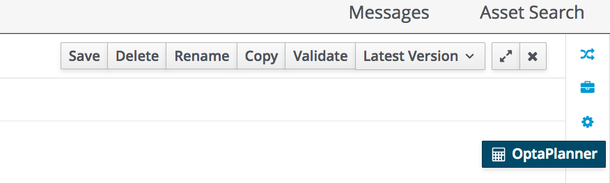
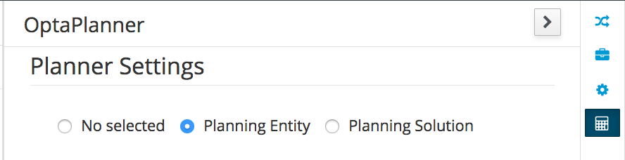
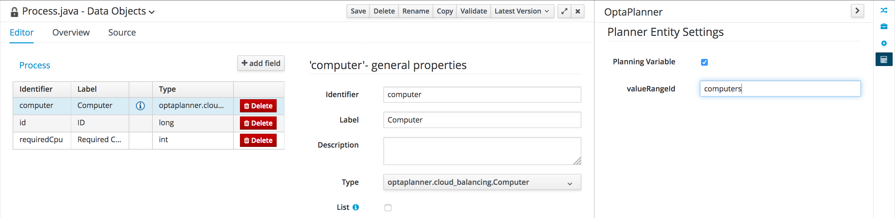

We need to add some additional configuration to our domain model to tell Business Resource Planner what the entities are that we want to plan, which planning variables are available and which class defines the solution.

The Data Modeling tool in Business Central provides extensive support for BRP/OptaPlanner annotations and configurations. To add a planner specific configuration to an existing model, simply open the specific data model and click on the *OptaPlanner* icon on the far right of the editor.

We will first configure the `Process` model as our `@PlanningEntity`. The `@PlanningEntity` defines the objects that we need to plan and thus the objects that the planner can change during planning. In our Cloud Balancing example this is the `Process`, as we need to assign processes to computers. During planning, BRP/OptaPlanner will change the assignment of these processes to different computers.

1. Open the `Process` model.
2. Open the *Planner Settings* panel by clicking on the *OptaPlanner* icon on the far right of the editor.
3. Select *Planning Entity*.

Now we need to configur the `@PlanningVariable`. In this example, our `@PlanningVariable` is the `computer` attribute/field of the `Process`.

1. Click on `computer` field in the `Process` model.
2. In the *Planner Settings* enable *Planning Variable* and use `computers` as the *valueRangeId*

Save the `Process` model.

Next we need to configure the `@PlanningSolution`:

1. Open the `CloudBalancingSolution` model.
2. In the *Planner Settings* panel select *Planning Solution*.
3. Set *Solution Score Type* to `HardSoftScore` (the default).
4. Select the `computers` field.
5. In the *Planner Settins* panel, enable *Planning Value Range Provider* and set the *id* to `computers` (this value must match the *valueRangeId* that we set on the `computer` planning variable on the `Process` model).
