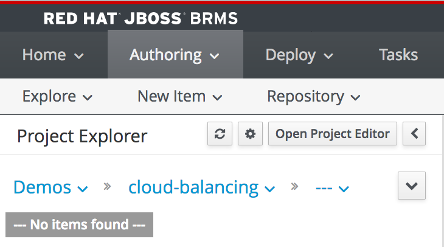

We can now create our first planner project. A JBoss BRP project can contain various types of assets:

1. Domain Model: the model of the problem. The model contains artefacts like *Planning Entities*, *Planning Variables* and a *Planning  Solution*.
2. Constraint Rules: business rules that define the (hard- and soft) constraints of the planning problem.
3. Solver Configuration: the configuration of the solver, in which, for example, the heuristic algorithms are configured.
4. etc.

To create the project, perform the following steps:

1. Click on *Authoring -> Project Authoring”*
2. Select the "cloud-balancing" repository in the breadcrumbs right under the text *Project Explorer*.

3. Click on *New Item -> Project*
4. Provide the following details:
- Project Name: `cloud-balancing`{{copy}}
- Group ID: `optaplanner`{{copy}}
- Artifact ID: `cloud-balancing`{{copy}}
- Version: `1.0.0`{{copy}}
5. Click on the *Finish* button

We've now created our first Planner project and can now start creating rules assets. We will begin with creating our domain-model.
