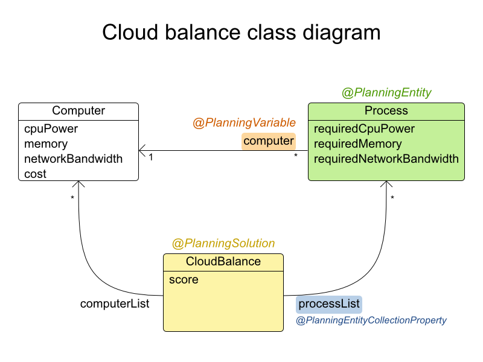
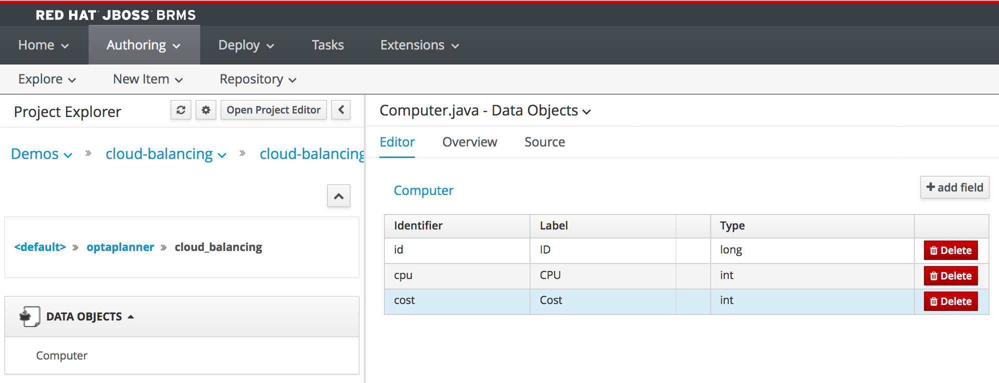
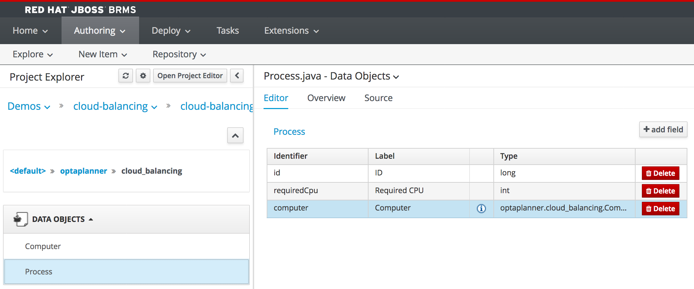
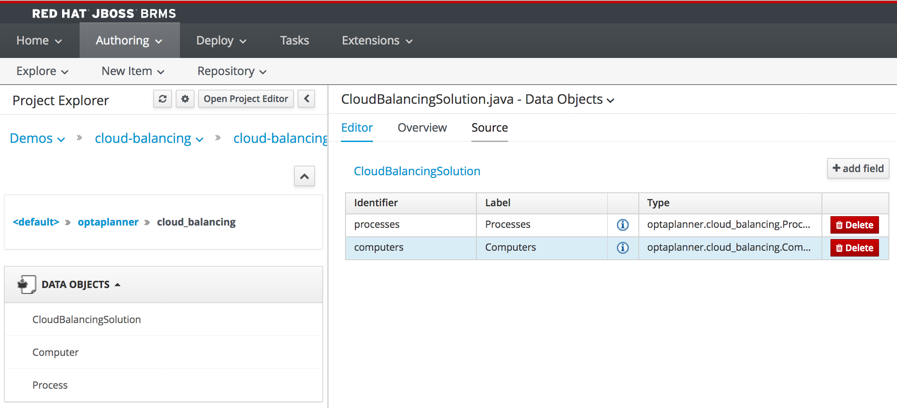

The first asset we need to create is our domain-model. The domain-model defines the planning *entities*, *variables* and *solution* which needs to be optimized by BRP.

A domain-model in JBoss BRP can have many forms. As BRP is a Java-based constraint satisfaction solver, it operates on Java POJOs (Plain Old Java Objects). As such we can both re-use existing (corporate) data-models defined in external JARs (Java Archives), as well as define these POJOs in our planner project as assets. JBoss BRP provides a simple data modeling tool that allows business users to create their domain-models without having to know the Java programming language. Second, the data modeling tool provides extensive support for BRP specific configurations on the domain-model, liek the configuration of *Planning Entities*, *Planning Variables* and *Planning Solutions*.

For the *Cloud Balancing* demo we will create a simple domain model consisting of 3 classes:

1. Process: the process that needs to be assigned to a computer. This is our `@PlanningEntity`.
2. Computer: the computer to which we need to assign zero or more processes. This is the `@PlanningVariable`.
3. CloudBalancingSolution: defines the planning solution, which contains a list of all process to be planned, a list of all available computers and a `ScoreHolder` that holds the planning score of the solution. This class is the `@PlanningSolution`.

Let's create the model:

1. Click on *New Item -> Data Object*
2. Give the object the name `Computer`{{copy}}
3. Set the package to `optaplanner.cloud_balancing`{{copy}}
4. Click on *OK*

Give the object two fields:
1. Click on *+ add field*
2. Add the field with *Id* "id"{{copy}} and *Label* "ID"{{copy}} of type "long".
3. Click on *Create and Continue*
4. Add the field with *Id* "cpu"{{copy}} and *Label* "CPU"{{copy}} of type "int"
5. Click on *Create and Continue*
6. Add the field with *Id* "cost"{{copy}} and *Label* "Cost"{{copy}} of type "int"
7. Click on *Create*
8. Click on the *Save* button to save the model.

Next, create a data object with name `Process`{{copy}} in package `optaplanner.cloud_balancing`{{copy}} with the following fields:

1. id{{copy}}: long (Label: ID)
2. requiredCpu{{copy}}: int (Label: Required CPU)
3. computer{{copy}}: optaplanner.cloud_balancing.Computer (Label: Duration)

Make sure to also save this model using the *Save* button in the editor. We can now create our rules.

Finally we will create our *PlanningSolution* class. Create another data object with name `CloudBalancingSolution`{{copy}} in package `optaplanner.cloud_balancing`{{copy}} with the following fields:

1. processes{{copy}}: List<optaplanner.cloud_balancing.Process> (Label: Processes)
Note that you can create a `List` of a certain type by selecting the type and checking the *List* checkbox.
2. computers{{copy}}: List<optaplanner.cloud_balancing.Computer> (Label: Computers)

Save the model.

We can now annotate the model with Business Resource Planner/OptaPlanner annotations to complete our domain model definition.
