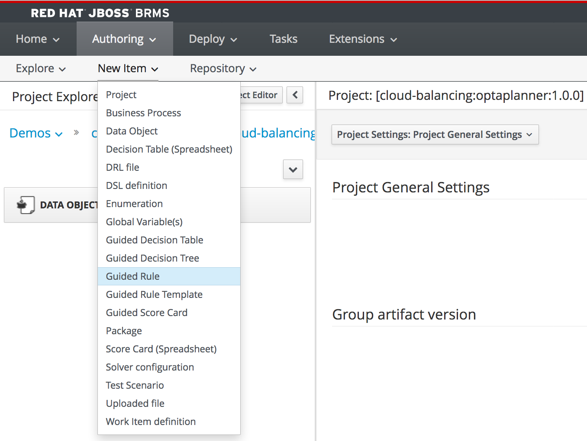

We will implement our *hard constraints* using the Business Central *Guided Rule Editor*. The *Guided Rule Editor* allows us to implement rules that define our hard constraint in an easy to use, business focussed, rules editor.

To implement our constraint, we first need to define a *Guided Rule*:

1. Open the Business Central console at [http://localhost:8080/business-central](http://localhost:8080/busines-central). Navigate to the `cloud-balancing` project that we created earlier.
2. Create a new guided rule by clicking on *New Item -> Guided Rule*. Give it the name `totalCpuHardConstraint`.

We now have an empty Guided Rule. In this rule we now need to implement the following logic:

*For each Computer sum up the total required CPU of all Processes assigned to this computer. If the total CPU requirement exceeds the available CPU of the computer, add a hard constraint.*

To implement this:

1. Click on the *+*-sign next to the *WHEN* label in the editor to create a new constraint. Select `Computer` and click *OK*.
2. Click on  `Computer`. In the *Variable name* field, add the value `$c` and click on *Set* to add a binding.
3. Click on `Computer` again to add a new constraint on a field. In the *Add a restriction on a field* box, select `cpu`.
4. Click on `cpu` and bind the field to the variable name `$cpu`.
5. Click again on the *+*-sign next to the *WHEN* label to add another constraint. Select `From Accumulate`.
6. Click on *click to add pattern* above the `From Accumulate` statement. Select 'Number'.
7. 

The final rule should look like this:

