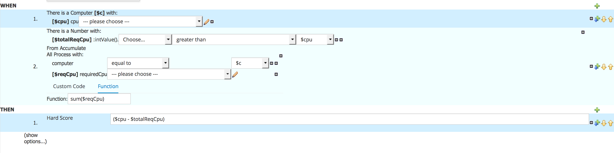

We will implement our *hard constraints* using the Business Central *Guided Rule Editor*. The *Guided Rule Editor* allows us to implement rules that define our hard constraint in an easy to use, business focussed, rules editor.

To implement our constraint, we first need to define a *Guided Rule*:

1. Open the Business Central console at [http://localhost:8080/business-central](http://localhost:8080/busines-central). Navigate to the `cloud-balancing` project that we created earlier.
2. Create a new guided rule by clicking on *New Item -> Guided Rule*. Give it the name `totalCpuHardConstraint`.

We now have an empty Guided Rule. In this rule we now need to implement the following logic:

*For each Computer sum up the total required CPU of all Processes assigned to this computer. If the total CPU requirement exceeds the available CPU of the computer, add a hard constraint.*

To implement this:

1. Click on the *+*-sign next to the *WHEN* label in the editor to create a new constraint. Select `Computer` and click *OK*.
2. Click on  `Computer`. In the *Variable name* field, add the value `$c` and click on *Set* to add a binding.
3. Click on `Computer` again to add a new constraint on a field. In the *Add a restriction on a field* box, select `cpu`.
4. Click on `cpu` and bind the field to the variable name `$cpu`.
5. Click again on the *+*-sign next to the *WHEN* label to add another constraint. Select `From Accumulate`.
6. Click on *click to add pattern* above the `From Accumulate` statement. Select `Number`.
7. Click on *click to add pattern* below the `From Accumulate` statement. Select `Process`.
8. Click on `Process`. In the *Add a restiction on a field* box, select `computer`.
9. In the `--- please choose ---` dropdown list next to `computer`, select `equal to`.
10. Click on the pencil icon next to `equal to`, click on *Bound variable*. In the `Choose...` dropdown list, select `$c`. This constraint makes sure that we accumulate all the processes that have been assigned to the `Computer` defined in step 1.
11. Click on `Process` again. In the *Add a restriction on a field* box, select `requiredCpu`.
12. Click on `requiredCpu` and bind the field to the variable name `$reqCpu`.
13. In the `Function` field, define the function `sum($reqCpu)`.
14. Click on `Number` to add another field constraint. Click on *Expression editor*. In the `Choose...` dropdown list, select `intValue()`.
15. In the `--- please choose ---` dropdown list, select `greater than`.
16. Click on the pencil, click on *Bound variable*. In the `Choose...` dropdown list, select `$cpu`. This constraint causes the rule to only fire if the sum of the required CPUs of all processes assigned to this computer is greater than the number of CPUs on the computer.
17. Click on the *+*-sign next to the *THEN* label in the editor to create a new consequence. Select ``

The final rule should look like this:

