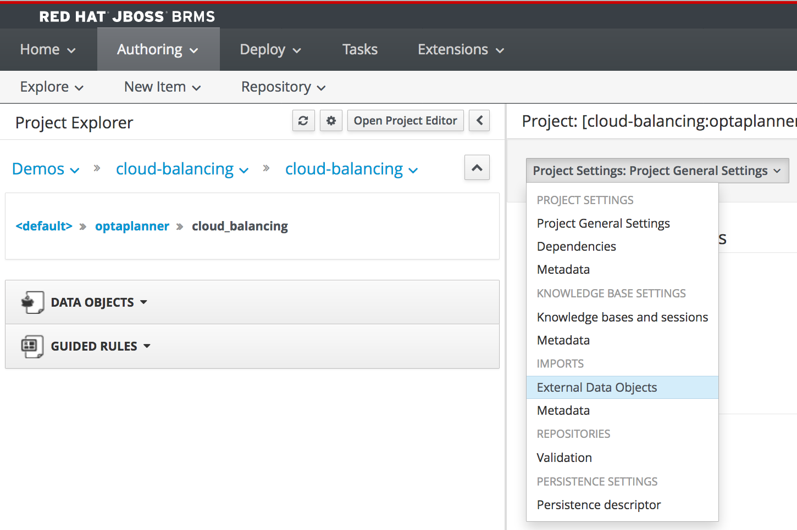
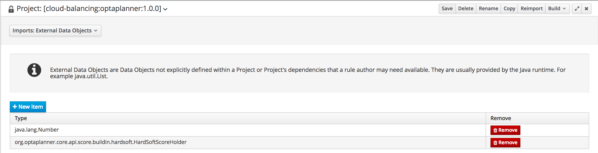

To keep track of the planning score determined by our planning constraint rules, we need a Drools global variable. We will name this global variable `scoreHolder`. Because we have configured our *Solver* to use a *HardSoftScore*, our `scoreHolder` needs to be of type `org.optaplanner.core.api.score.buildin.hardsoft.HardSoftScoreHolder`.

In order to be able to define variables of type `HardSoftScoreHolder`, we need to import this class type into our project:

1. Click on *Open Project Editor*. In the drop-down list of the Project Editor, select *Imports - External Data Objects*.

2. Click on *+ New Item* and set `org.optaplanner.core.api.score.buildin.hardsoft.HardSoftScoreHolder` as the *Import Type*.

3. Click on *Save* to persist the project settings.

We can now create our `scoreHolder` global variable:

1. Click on *New Item -> Global Variable(s)*. Give it the name *CloudBalancingSolutionScoreHolderGlobal*.
2. In the editor, click on *Add*. Give the variable the alias `scoreHolder` and select the Class Name `org.optaplanner.core.api.score.buildin.hardsoft.HardSoftScoreHolder`.
3. Click on *Save* to save the global variable.

Now that we have create our `scoreHolder`, we can implement our score rules.
