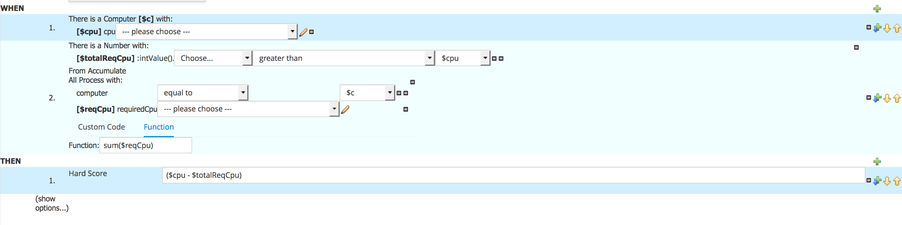

After implementing the *hard-constraints*, which define whether a solution is feasible or infeasible, we can now specify our *soft-constraints*.

Like the *hard-constraints*, we will implement our *soft-constraints* using the Business Central *Guided Rule Editor*. Our *soft-constraint* is to minimize the total costs of our computers. I.e. we add the costs of every computer that has at least one process assigned to it to our *soft-constraint*. Unlike our *hard-constraint*, the goal of our *soft-constraint* is not to reach 0 but to minimize the score. A solution with a minimal score is a solution with the minimal computer costs to run our processes

1. Create a new guided rule by clicking on *New Item -> Guided Rule*. Give it the name `totalCostsSoftConstraint`{{copy}}.

We now have an empty Guided Rule. In this rule we now need to implement the following logic:

*For each Computer that has at least one Process assigned to it, add a negative soft-constraint equal to the costs of the given Computer.*

To implement this:

1. Click on the *+*-sign next to the *WHEN* label in the editor to create a new constraint. Select `Computer` and click *OK*.
2. Click on  `Computer`. In the *Variable name* field, add the value `$c` and click on *Set* to add a binding.
3. Click on `Computer` again to add a new constraint on a field. In the *Add a restriction on a field* box, select `cost`.
4. Click on `cpu` and bind the field to the variable name `$cost`.
5. Click again on the *+*-sign next to the *WHEN* label to add another constraint. Select `The following exists ...`.
6. Click on *click to add pattern*. Select `Process`.
8. Click on `Process`. In the *Add a restiction on a field* box, select `computer`.
9. In the `--- please choose ---` dropdown list next to `computer`, select `equal to`.
10. Click on the pencil icon next to `equal to`, click on *Bound variable*. In the `Choose...` dropdown list, select `$c`. This constraint makes sure that the `Computer` defined in step 1 has at least 1 `Process` assigned to it.
11. Click on the *+*-sign next to the *THEN* label in the editor to create a new consequence. Select *Add free form DRL*.
12. Add the following DRL code which sets the hard score: `scoreHolder.addSoftConstraintMatch(kcontext, -($cost));`{{copy}}.

The soft-constraint has now been set to the cost of the `Computer` that has at leats 1 `Process` assigned to it. Note that this rule will match all computers that have at least one process asssigned to them, and the soft-constraints (the costs) of these computers will be summed up.

We have now implemented the full project, including the domain-model, the Planner configuration and the hard- and soft-constraint rules. We will now deploy our project onto OpenShift.

The final rule should look like this:

