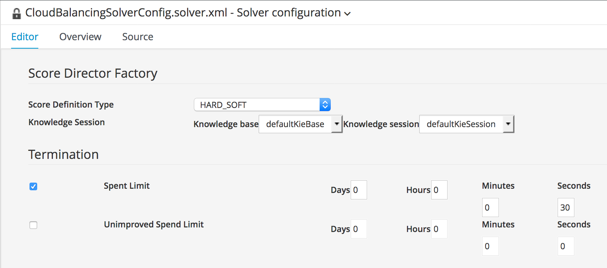

The *Solver Configuration* defines the configuration of the Business Resource Planner/OptaPlanner *Solver*. Configuration options are, for example, the kind of heuristic algorithms are used in the *Construction Heuristics* and *LocalSearch* phases of the planner, termination configurations of the solver (i.e. when should the solver stop solving and return the result), the type of score we will use (HardSoft, HardMediumSoft, ...), etc.

To create the *Solver Configuration*:

1. Click on *New Item -> Solver Configuration*. Give it the name `CloudBalancingSolverConfig`.
2. Enable the *Spent Limit* and set it to 30 seconds.
3. Click *Save* to save the solver configuration.

We now have a solver configuration that uses the standard Business Resource Planner/OptaPlanner phases and algorithms and that will terminate the solver after 30 seconds. The *ScoreDefinitionType* used is the default *HARD_SOFT*. The Drools KIE-Base and KIE-Session used for our score constraint rules are are the default KIE-Base and KIE-Session of our project.
